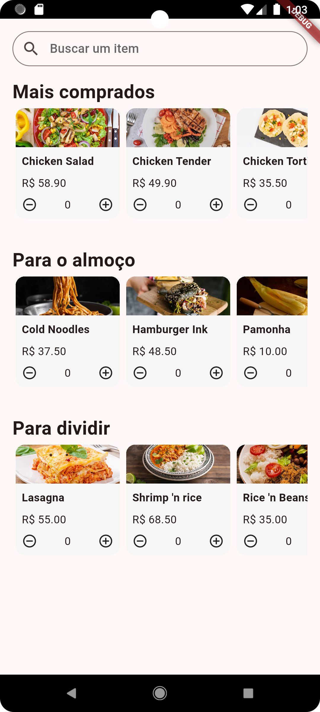
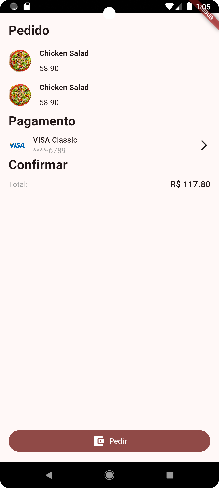

# Flutter: Gerenciamento de estados com Mob

## Requisitos:

- Conhecimentos básicos de Flutter e Dart
- Android Studio ou VS Code (com plugins do Flutter e Dart instalados)
- Conhecimento de gerenciamento de estados com Provider
- É importante ter o Flutter na versão 3.7.1

## 🛠️ Abrir e rodar o projeto

Aqui vem um passo a passo para abrir e rodar o projeto.

- **Open an Existing Project** (ou alguma opção similar)
- Procure o local onde o projeto está e o selecione (Caso o projeto seja baixado via zip, é necessário extraí-lo antes de procurá-lo)
- Por fim, clique em OK
- Primeiro, abra o projeto e baixe as dependências com o comando `flutter pub get`, depois basta rodar o comando `flutter run` na pasta do projeto

## Projeto

O projeto consiste em uma aplicação de venda de comidas, onde podemos selecionar a quantidade e adicionar no carrinho.

### Tela Inicial

Com produtos selecionados, podemos visualizar e abrir o carrinho.

### Carrinho

Podemos também abrir o carrinho para verificar a quantidade de produtos selecionados.
